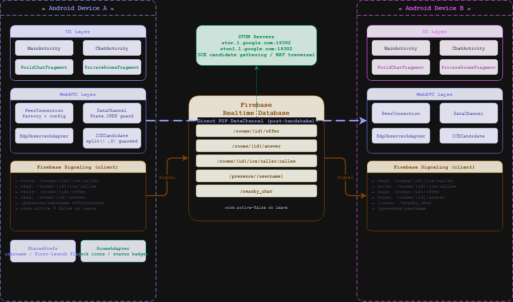
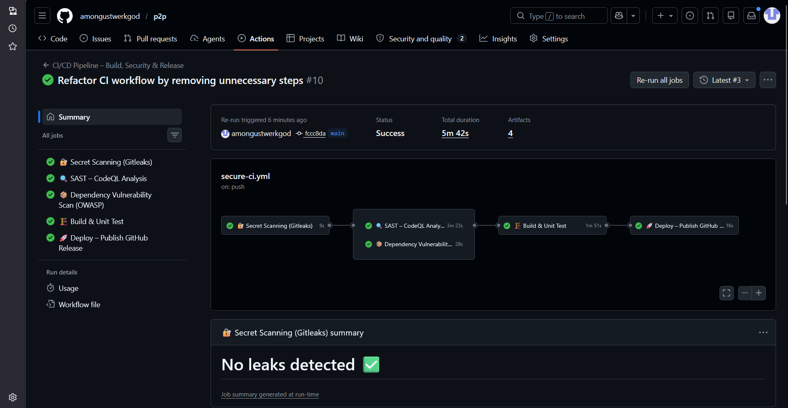
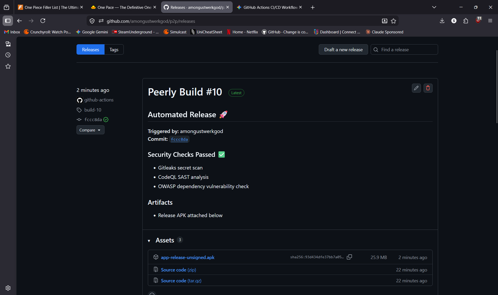

# Peerly - DevOps Mini Project

**Author:** Saksham Raturi
shlok Dobriyal
Vishvajeet Singal

## 1. Project Title
Peerly

## 2. Problem Statement
The goal of this project is to implement a robust, secure, and fully automated CI/CD pipeline for the Peerly Android application. Manual building, testing, and deployment processes are prone to human error and lack security oversight. This DevOps enhancement introduces automated secret scanning, static application security testing (SAST), dependency vulnerability audits, and automated release generation to ensure the application is secure and consistently deployable.

## 3. Architecture Diagram

## 4. CI/CD Pipeline Explanation
The CI/CD pipeline is implemented using GitHub Actions (`ci.yml`) and consists of a structured, multi-stage workflow:
- **🔐 Secret Scanning (Gitleaks):** Runs first to scan the repository for any hardcoded secrets, API keys, or tokens.
- **🔍 SAST (CodeQL):** Analyzes the compiled Java source code to detect security vulnerabilities (e.g., path traversal, intent injection). Uses `build-mode: manual` to correctly trace the Android build process.
- **📦 Dependency Audit (OWASP):** Scans all Gradle dependencies against the NVD CVE database to prevent the inclusion of libraries with high/critical vulnerabilities.
- **🏗️ Build & Unit Test:** Compiles the Android project (`assembleRelease`), injects `google-services.json` securely from GitHub Secrets, and runs unit tests. Artifacts are cached for pipeline optimization.
- **🚀 Deploy (GitHub Release):** Upon a successful merge to `main`, this job automatically generates a GitHub Release and attaches the compiled `.apk` file for distribution.

## 5. Git Workflow Used
- **Feature Branching:** Development and pipeline configuration were isolated in a feature branch (`feature/devops-enhancement`).
- **Pull Requests (PRs):** Code was integrated into the `main` branch exclusively through Pull Requests to enforce code review and trigger automated CI checks.
- **Commit History:** Maintained a structured commit history with meaningful commit messages to track the evolution of the DevOps pipeline.

## 6. Tools Used
- **Version Control:** Git & GitHub
- **CI/CD:** GitHub Actions
- **Build Tool:** Gradle
- **Security Scanners:** Gitleaks, GitHub CodeQL, OWASP Dependency-Check
- **Languages:** Java (Android)

## 7. Screenshots
### Pipeline Success

*(Note: Add your successful GitHub Actions run screenshot here)*

### Deployment Output

*(Note: Add your GitHub Release / APK deployment screenshot here)*

## 8. Challenges Faced
- **CodeQL Compilation:** Resolving CodeQL analysis failures by switching to `build-mode: manual` and explicitly defining the Gradle build step (`assembleDebug`) so the autobuilder could correctly trace the Java call graph.
- **OWASP Artifact Paths:** Fixing artifact upload errors by explicitly defining the output directory (`--out reports`) for the OWASP HTML report so the pipeline could locate it.
- **Secret Management:** Securely handling the `google-services.json` file. Instead of committing it to version control, it was stored as a GitHub Secret and dynamically injected into the build environment during pipeline execution.
- **Pipeline Optimization:** Implementing Gradle caching to speed up build times and reduce runner execution minutes.
